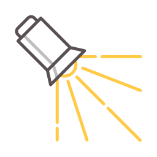

    <picture>
        <source srcset="img/lumiere-256.png" media="(prefers-color-scheme: dark)">
        <source srcset="img/lumiere-256.png" media="(prefers-color-scheme: light)">
        
    </picture>

<h1 align="center">Lumiere</h1>

**Lumiere** is a next-generation, production-ready path tracer engine that allows artists and developers to render scenes in 3D. Through the use of the Vulkan API, Lumiere (current roadmap) offers features unseen by other path tracing systems such as:

- **Light Transport Framework** that is pysically accurate through
  - consistency with the physical properties of both light and materials,
  - consistency with Maxwell's electromagnetic theory,
  - consistency with general relativity.
- Implementations of **various paradigms** (e.g. Blinn-Phong, MCMC-based methods, etc).
- **Integration** with other 3D creation tools such as Blender or Cinema4D.
